# Autolanzamiento Legion Commander

## Descripción

- Te olvidas activar tus items antes de un duelo ? XD

- Te evaden el duelo con LINKEN ? :(

- Este programa te ayudara¡

- Con solamente una tecla dile adios a todo eso ..... siuuuuu

## Configuración

Abrir lc3.exe

1. Abrir `lc3.exe`

  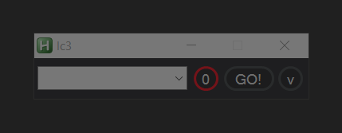

2. Configurar teclas de acceso rapido

- Habilidades

  

    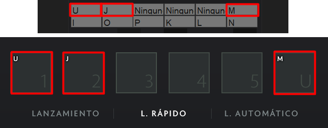
  

  * Items

  

    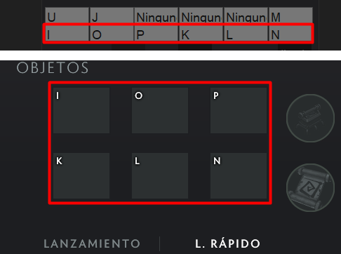
  

3. Asignar una tecla de Lanzamiento de `Combo` o marcar como Ctrl + Click.

  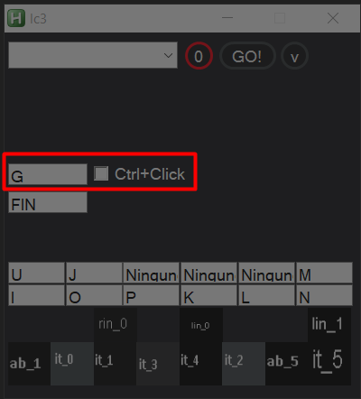

4. Presionar `Go!` para guardar Teclas

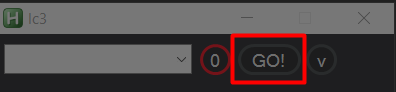

5. Presionar `Botón Rojo` para activar o desactivar macro

## Uso

1. Por Teclas/Interfaz Habilitar habilidades o items según los obtengas en el Juego;

2. presionar `Tecla de Combo` para lanzar habilidades o items `activados` hacia donde esté apuntando el cursor.

## ¿Como activo habilidades o Items?

Hay 2 formas de hacerlo

1. Por Teclas.

- **F5**: Habilitar/Deshabilitar 2da Habilidad
- **7**: Habilitar/Deshabilitar 5ta Habilidad

- **F6**: Habilitar/Deshabilitar 1er Item
- **8**: Habilitar/Deshabilitar 2do Item
- **F7**: Habilitar/Deshabilitar 3er Item
- **9**: Habilitar/Deshabilitar 4to Item
- **F8**: Habilitar/Deshabilitar 5to Item
- **0**: Habilitar/Deshabilitar 6to Item

2. Por Interfaz

   - presionar `Ctrl + girar ruedita del raton` para ver o ocultar habilidades o items activados;

   - Click `Cuadritos` correspondiente a la habilidad o item para activar;

     

     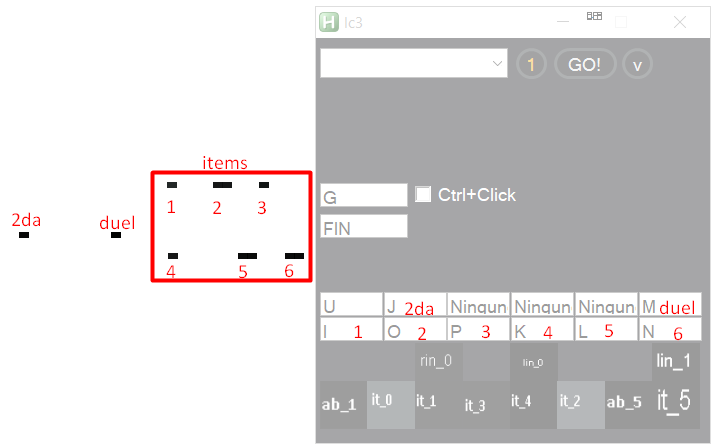
   

## CONFIGURACION EVADIR LINKENS :)

1. Abrir Dota2 y probar el heroe Legion Commander.
2. Crear un Enemigo cualquiera
3. Comprar un item para desabilitar LINKEN (alabarda, abisal, etc..)
y colocarlo en el espacio de items 5 o 6;

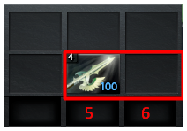
 

4. Abrir el programa `Capturador de color.exe`.
5. usar `ctr lizquierdo` para posisionar la cruz donde este el cursor,
   mueve la cruz para mas presisión con `w`, `s`, `a`, `d`debe quedar asi:

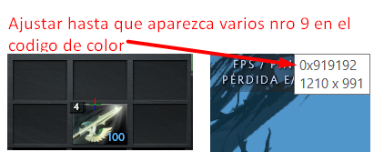
 

6. Usar el item en un enemigo y presionar `Numpad 1` en caso estés configurando el espacio 6 de items presionar `Numpad 2`.

7. Presionar el Botón `Exportar` esta a lado inferior izquierdo de tu pantalla;

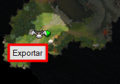
 

- Y listo está configurado las cordenadas personalizadas para tu pantalla;

8. Abrir `lc3.exe` y seleccióna la obción que se creó

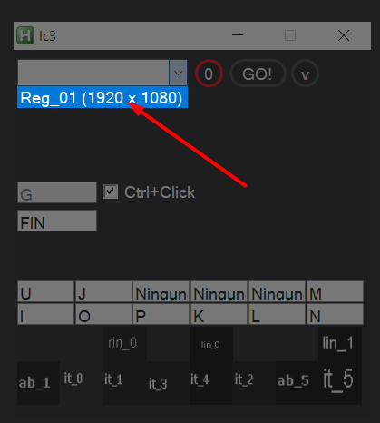
 

9. marcar las `2 casillas` o presionar `9 dos veces` del espacio de items 5 o 6 para que en el `combo` se use el item antes de usar duelo.

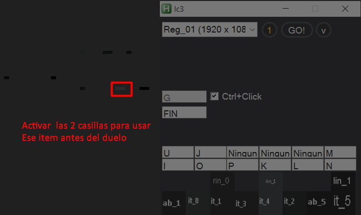
 

## IMPORTANTE

- Accesos directos
`(Tecla combo) + doble click`: Usa el item 4 de preferencia poner BKB ahi ya que aveces se usa en entradas y aveces no :v

  

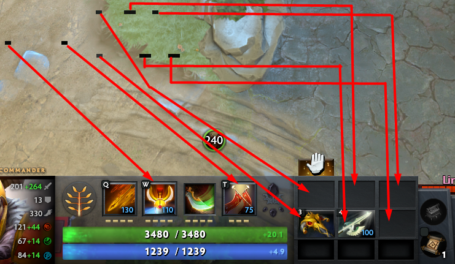
 

- `Escape`: Cierra el programa
- `FIN`: Habilita o Deshabilita los macros
- `Ctrl + F5`: desmarca todos los casilleros (como un reinicio)

